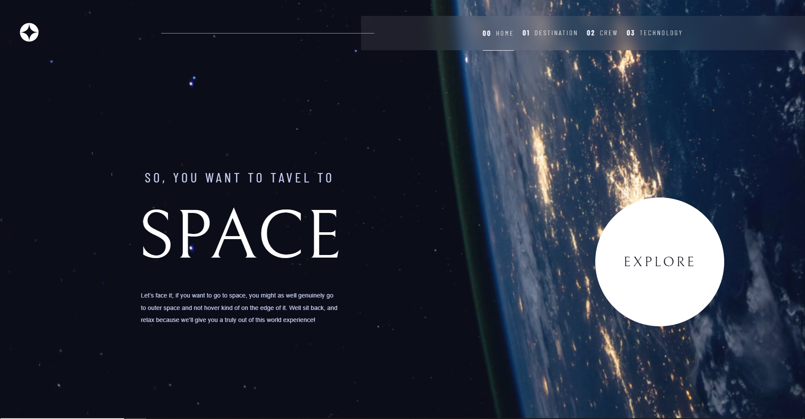

# Frontend Mentor - Space tourism website solution

This is a solution to the [Space tourism website challenge on Frontend Mentor](https://www.frontendmentor.io/challenges/space-tourism-multipage-website-gRWj1URZ3). Frontend Mentor challenges help you improve your coding skills by building realistic projects. 

## Table of contents

- [Overview](#overview)
  - [The challenge](#the-challenge)
  - [Screenshot](#screenshot)
  - [Links](#links)
- [My process](#my-process)
  - [Built with](#built-with)
  - [What I learned](#what-i-learned)


## Overview

### The challenge

Users should be able to:

- View the optimal layout for each of the website's pages depending on their device's screen size
- See hover states for all interactive elements on the page
- View each page and be able to toggle between the tabs to see new information

### Screenshot



### Links

- Solution URL: [Add solution URL here](https://your-solution-url.com)
- Live Site URL: [Add live site URL here](https://your-live-site-url.com)

## My process
I did the Mobile-first workflow although, I do not know if I have made it the right way. But I still, I am happy that I keep learning and learning. Hoping I will be able to code perfectly clean.

### Built with

- Semantic HTML5 markup
- CSS custom properties
- Flexbox
- CSS Grid
- Mobile-first workflow


### What I learned

```js
function showTech(category,name){
    try{
        fetch('./data.json')
        .then(response => response.json())
        .then(data => {
            const res = data[category]
            const index = res.findIndex(item => {
                return item.name === name
            });
            title_name.innerHTML = res[index].name.toUpperCase()
            desc.innerHTML = res[index].description
            if(desktop.matches){
                img.src = res[index].images.portrait
            } else {
                img.src = res[index].images.landscape
            }
        })
    }
    catch(error){
        console.error("Something went wrong...")
    }
}
```

## Author

- Frontend Mentor - [@jsllcllr8](https://www.frontendmentor.io/profile/jsllcllr8)
